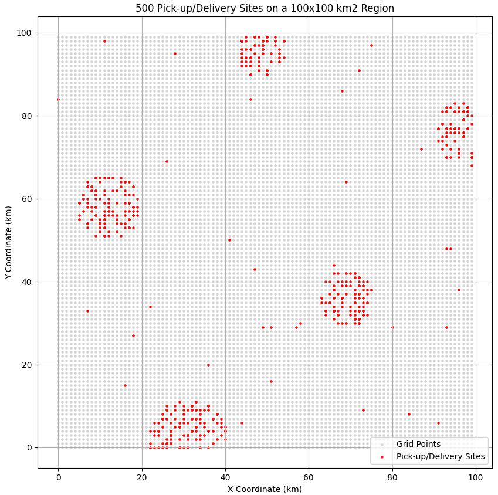

## Important files description

* `parameters.yaml`: parameters that will be used by the python scripts below to generate the synthetic data 
* `region.py`: script that generates the region and the pick-up/delivery sites (and also a "region.png" for visualization)
* `matrix.py`: script that creates "matrix_A_dist.txt" and "matrix_A_time.txt" according to the region data (saved as "region_data.pkl")
* `classi_merc_mezzi_ger.py`: script that generates "classi_merc.txt" and "mezzi_gerarchia.txt"
* `mezzi.py`: script that generates "mezzi.txt"
* `spedizioni.py`: script that generates "spedizioni.txt"

## What is a region?

A region is a grid of points that simulates an area containing cities. Grid points are 1 Km spaced by default (you can change this in *cell_size_km* in `parameters.yaml`), and can be pick-up/delivery sites (red in the plot) or regular points (grey in the plot). Each group of points denotes a city, which has a radius in the range [city_radius_min, city_radius_max] (specified in the parameters file). These groups are created by randomly place *num_cities* points in the grid, satisfying the *min_distance_km* constraint, and then randomly place, for each of them, other points around, within a radius value chosen independently for each city in the interval above. This will allow having cities of various size and number of sites. With a small probability, sites are also placed in between cities.

<p align="center">

</p>

## Setup

To start generating the instances you need to setup the environment first. Assuming you have conda, you can hit the following:

```bash
conda create --name delivery python=3.10
conda activate delivery
pip install -r requirements.txt
```

## How to generate one instance?

To generate all the required files at once (that is "mezzi.txt", "spedizioni.txt" etc.) you have to:
1. Change the parameters inside `parameters.yaml` according to the type of instance you want to generate
2. Run the following bash command, replacing *<instance_directory>* with the name of the directory that will contain your instance files. Optionally, you can add a seed to always have the same results given a fixed set of parameters. If no seed is passed as argument, then results will always be different.

**Note**: The directory will be created automatically if it does not exist already.
```bash
bash start.sh <instance_directory> [<seed>]
```

**E.g.**: this will create a folder named `instance1` in the current directory containing all the instance-related files.
```bash
bash start.sh instance1 442
```

If you wish to generate specific files, e.g. just the "spedizioni.txt", you can run the corresponding script like this:
```bash
python spedizioni.py --parameters parameters.yaml --output_dir instance1 --seed 442
```

**Note**: The files must be generated following the order: region > matrix > classi merci > mezzi gerarchia > mezzi > spedizioni. If you wish to change, for instance, just the "classi_merc.txt" and/or "mezzi_gerarchia.txt" by running the corresp. `classi_merc_mezzi_ger.py`, you have to regenerate "spedizioni.txt", as otherwise there could be value inconsistencies.

## Region generation taking too much?

If the region generation takes too much to compute try relaxing the parameters, making them more reasonable. E.g. if you want to fit a lot of sites in a lot of cities in a very small region area such that the cities are spread apart, it might be hard for the algorithm to find a proper way to organize that, since it goes random and the constraints are very tight.
